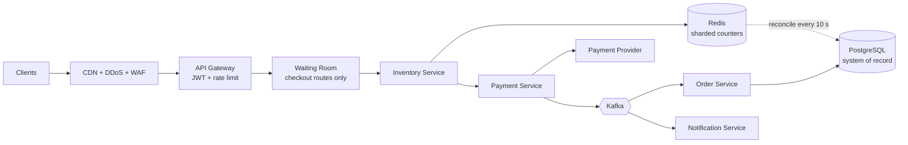
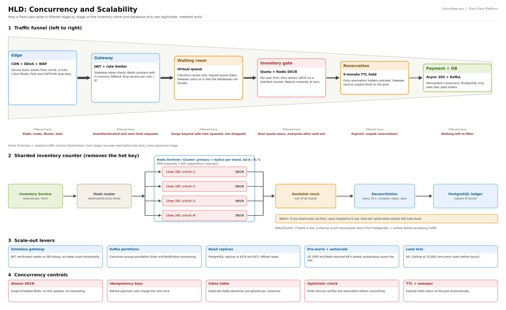
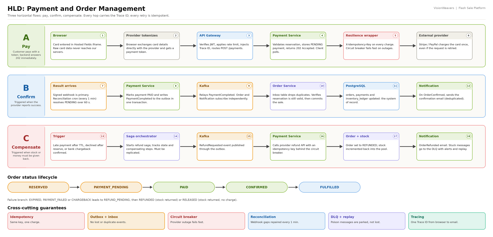
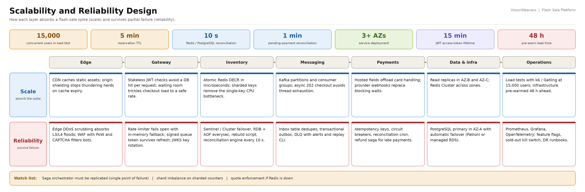
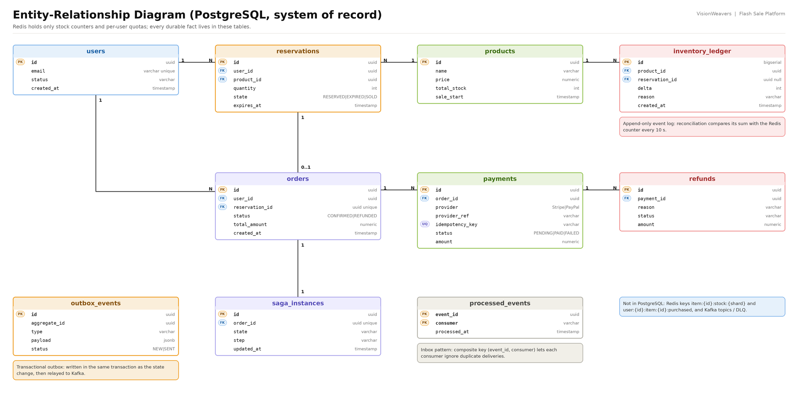
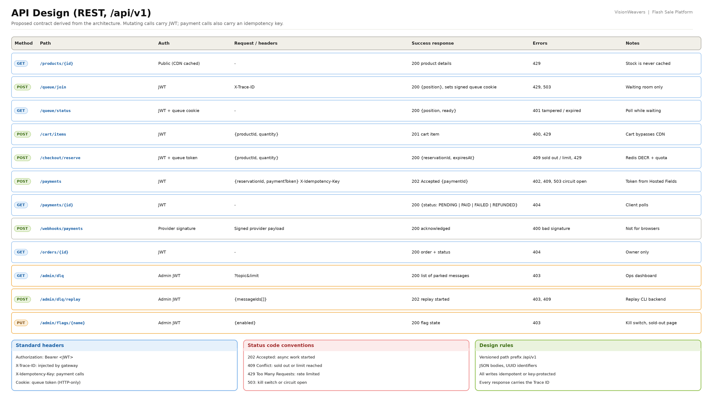
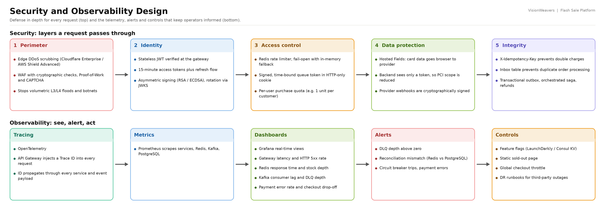

# ArchiTrio: Flash Sale Platform

  A high-concurrency, fault-tolerant e-commerce backbone that sells every unit of a limited-stock drop **exactly once**, keeps customers' money correct, and stays standing while millions of people and bots hit the same product at the same second.


---

## Table of Contents

1. [Problem Statement](#1-problem-statement)
2. [Requirements](#2-requirements)
3. [Solution at a Glance](#3-solution-at-a-glance)
4. [Novel Ideas and Key Design Innovations](#4-novel-ideas-and-key-design-innovations)
5. [Architecture in Detail](#5-architecture-in-detail)
6. [Failure Handling Matrix](#6-failure-handling-matrix)
7. [Data Model](#7-data-model)
8. [API Overview](#8-api-overview)
9. [Security and Observability](#9-security-and-observability)
10. [Technology Stack](#10-technology-stack)
11. [Repository Structure](#11-repository-structure)
12. [Design Documentation Index](#12-design-documentation-index)
13. [Getting Started](#13-getting-started)
14. [Testing and Load Testing](#14-testing-and-load-testing)
15. [Architecture Decisions](#15-architecture-decisions)
16. [Open Questions and Roadmap](#16-open-questions-and-roadmap)
17. [Team and License](#17-team-and-license)

---

## 1. Problem Statement

A flash sale is the hardest traffic pattern in e-commerce. A small, fixed amount of stock is released at a known moment, and a very large crowd arrives at once, all wanting the **same item**. Ordinary shop architectures fail here in predictable ways:

| Pain point | What goes wrong in a naive system |
|---|---|
| **Thundering herd** | Millions of simultaneous requests hit one product page and one checkout route, exhausting threads, connections and database capacity. |
| **Overselling** | Relational row locks cannot absorb the contention on a single stock row, so the system either collapses or sells more units than exist. |
| **Hot key** | Even a fast in-memory counter becomes a bottleneck when everyone decrements the same key. |
| **Bots and scalpers** | Automated scripts with rotating IPs and fake accounts buy hundreds of units before real customers can. |
| **Ambiguous payments** | A gateway timeout leaves you not knowing whether the card was charged. Retrying risks double charges; not retrying risks lost sales. |
| **Duplicate events** | Message brokers deliver at least once, so a retry can create two orders or send two emails. |
| **Partial failure** | Payment fails after stock was reserved, a reservation expires while a payment is in flight, or a third-party provider goes down. |
| **Operating blind** | Without traces, metrics and kill switches, engineers cannot see or stop a failure while it is happening. |

**The goal of this project** is an architecture that treats these as design constraints from day one: it filters load in stages, reserves stock without relational locks, makes every retry safe, and always has a defined path (including automatic refunds) for every failure.

---

## 2. Requirements

### 2.1 Functional requirements

| ID | Requirement |
|---|---|
| FR1 | Browse the flash-sale item; static content is served from the CDN edge cache. |
| FR2 | Authenticate users with short-lived tokens. |
| FR3 | Join a fair virtual waiting room before checkout when load is high. |
| FR4 | Reserve stock for a limited time (5 minutes) with a per-user purchase limit. |
| FR5 | Pay by card or PayPal through tokenized checkout; raw card data never reaches our servers. |
| FR6 | See payment progress: the API answers `202 Accepted` and the client polls for the final status. |
| FR7 | Receive order confirmation and an email notification. |
| FR8 | Automatically refund on late payment, payment failure after reservation, or chargeback, and return stock to the pool. |
| FR9 | Operator tools: replay dead-letter messages, toggle feature flags, switch on a static "Sold Out" page. |

### 2.2 Non-functional requirements

| Quality | Requirement |
|---|---|
| **Correctness** | Zero overselling. PostgreSQL is the system of record. |
| **Performance** | Sustain **15,000 concurrent users** in load tests (k6 / Gatling) before launch. |
| **Availability** | Services across 3+ Availability Zones; automatic failover for Redis and PostgreSQL. |
| **Reliability** | Idempotent payments and idempotent consumers; every retry is safe. |
| **Consistency** | Redis and PostgreSQL drift is detected and repaired every 10 seconds. |
| **Security** | PCI-DSS scope reduction, bot and DDoS resistance, signed tokens, signed webhooks. |
| **Observability** | End-to-end tracing, metrics, dashboards, alerts and runbooks. |
| **Resilience** | Circuit breakers, dead letter queue, compensating transactions. |

### 2.3 Key parameters

| Parameter | Value |
|---|---|
| Reservation TTL | 5 minutes |
| Redis vs PostgreSQL reconciliation | every 10 seconds |
| Pending-payment reconciliation | every 1 minute, for payments `PENDING` over 60 seconds |
| JWT access-token lifetime | 15 minutes |
| Load-test target | 15,000 concurrent users |
| Pre-warm lead time | 48 hours before the sale |
| Deployment | 3+ Availability Zones |

> Full analysis: [`SALESTORM_Requirement_Analysis.png`](SALESTORM_Requirement_Analysis.png)

---

## 3. Solution at a Glance

Traffic flows through seven layers. Each layer removes load before the next, more expensive one sees it.



| # | Layer | Responsibility |
|---|---|---|
| 1 | **Edge and traffic ingestion** | CDN with origin shielding, edge DDoS scrubbing, WAF with Proof-of-Work and CAPTCHA, elastic load balancer. |
| 2 | **Gateway and access control** | API Gateway, stateless JWT with JWKS, Redis rate limiter, virtual waiting room, signed queue token. |
| 3 | **Concurrency and inventory** | Sharded Redis atomic counters, per-user quota, 5-minute TTL sweeper, Redis HA, rebuild script, reconciliation engine. |
| 4 | **Microservices and messaging** | Product/Cart, Inventory, Payment, Order, Notification, Saga orchestrator on Apache Kafka with inbox, outbox and DLQ. |
| 5 | **Payments and resilience** | Hosted-fields tokenization, idempotency keys, circuit breakers, signed webhooks, reconciliation cron, refund saga. |
| 6 | **Data and infrastructure** | Multi-AZ services, PostgreSQL primary with replicas and automatic failover, pre-warming, load testing. |
| 7 | **Observability and operations** | OpenTelemetry, Prometheus, Grafana, feature flags, kill switch, DR runbooks. |

---

## 4. Novel Ideas and Key Design Innovations

The individual building blocks (Redis, Kafka, sagas) are well known. The value of this design is in **how they are combined** and the specific ideas used to close each gap that a flash sale exposes.

### Idea 1: A filtering funnel, not a flat pipeline
**Problem:** Every request reaching the database is expensive; most of them should never get there.
**Idea:** Order the defenses from cheapest to most expensive so each stage sheds load for the next: CDN absorbs static reads, DDoS scrubbing and WAF drop floods and bots, the gateway drops unauthenticated or over-limit calls, the waiting room meters checkout, and only then does Redis decide who gets stock. PostgreSQL only ever sees real, paid orders.
**Trade-off:** More moving parts at the edge; each needs its own thresholds and monitoring.

### Idea 2: A *targeted* virtual waiting room
**Problem:** Queuing the whole site hurts browsing and SEO for no benefit.
**Idea:** The waiting room sits **only** in front of critical, high-load dynamic routes such as `/checkout`. Browsing stays fast and cached; checkout traffic is trickled into the backend at a rate the databases can safely handle.

### Idea 3: Forgery-proof, refresh-proof queue tickets
**Problem:** Users lose their place when they refresh; scripts try to forge tokens to skip the line.
**Idea:** The waiting room issues a **cryptographically signed, time-bound JWT ticket** in an HTTP-only cookie, embedding a position hash and entry timestamp. The gateway verifies the signature on every checkout call and rejects tampered or expired tickets.

### Idea 4: Redis as a disposable "transactional window", PostgreSQL as truth
**Problem:** Row locks do not scale; a cache alone is not durable.
**Idea:** Stock is pre-loaded into Redis and reserved with an **atomic `DECR`** in microseconds. PostgreSQL remains the **system of record** with an append-only ledger. A **reconciliation engine** compares the two every 10 seconds, repairing small drift and alerting on large mismatches. Redis can be lost without losing truth.

### Idea 5: Sharded stock counters to kill the hot key
**Problem:** Millions of `DECR`s on `item:101:stock` saturate one Redis CPU core.
**Idea:** Split the counter into `item:101:stock:1..N`; route each user to a shard by hashing the user ID. Available stock is the sum of the shards.
**Trade-off:** Shard balance must be watched (see [Open Questions](#16-open-questions-and-roadmap)).

### Idea 6: A rebuildable inventory
**Problem:** If Redis restarts empty, the counter resets and overselling follows.
**Idea:** Besides primary-replica failover, RDB + AOF (`appendfsync everysec`), a **startup rebuild script** recomputes stock from committed inventory in PostgreSQL minus active reservations in the transactional outbox, and re-initializes the counter **atomically before accepting traffic**.

### Idea 7: "Never fail silently" late-payment handling
**Problem:** A 5-minute reservation can expire and be reallocated while the customer's payment is still in flight.
**Idea:** The Order Service does **optimistic state verification** when `PaymentCompleted` arrives. If the reservation was reclaimed, it triggers a **compensating transaction (automatic refund)** instead of overselling or failing quietly. Inventory integrity and financial correctness are both preserved.

### Idea 8: Quota enforced *before* the decrement
**Problem:** Rotating proxy IPs defeat IP rate limits.
**Idea:** A per-user, per-item purchase key in Redis (`user:{user_id}:item:{item_id}:purchased`) is checked **before** stock is decremented, so scalpers cannot burn inventory even with many fake accounts. It stacks with Proof-of-Work challenges and signed queue tickets.

### Idea 9: A rate limiter that fails open, with a local safety net
**Problem:** If Redis behind the limiter dies, failing closed blocks every customer and failing open can crash the backend.
**Idea:** Fail **open** for availability and immediately fall back to a lightweight **in-memory sliding-window counter on each gateway node**.

### Idea 10: Webhook-first payments with reconciliation for unknown outcomes
**Problem:** A `504` from the payment provider leaves the charge state unknown.
**Idea:** Return `202 Accepted` right away (no thread exhaustion). Trust **signed provider webhooks** for the definitive status, and run a **reconciliation cron every minute** that resolves any payment stuck in `PENDING` over 60 seconds by querying the provider's ledger directly.

### Idea 11: Two-sided idempotency
**Problem:** Retries on both ends of the system cause double effects.
**Idea:** Outbound, an `X-Idempotency-Key` makes retried charges safe. Inbound, an **inbox table** (`processed_events`) makes duplicate Kafka deliveries harmless. Together with the **transactional outbox**, no event is lost and none is applied twice.

### Idea 12: Operability as a feature
**Problem:** Engineers cannot protect a platform they cannot see or switch off.
**Idea:** A single observability stack (Prometheus, Grafana, OpenTelemetry) with a **Trace ID injected at the gateway** and carried through every service and event; a **DLQ with alerting and a safe-replay CLI** so a paid order is never stranded; and **feature flags plus a static "Sold Out" page** to shed non-essential load with one click.



---

## 5. Architecture in Detail

### 5.1 Checkout flow

1. The client requests the product; static assets come from the CDN. WAF challenges suspicious traffic.
2. The gateway verifies the JWT, injects a **Trace ID** and applies the rate limit.
3. For checkout, the client joins the waiting room and receives a **signed queue token**.
4. `POST /checkout/reserve`: Inventory Service checks the user quota, then performs `DECR` on a stock shard. Success returns a `reservationId` and `expiresAt` (5-minute TTL); failure returns `409`.
5. The browser sends card details **directly to the payment provider** (Hosted Fields) and receives a token.
6. `POST /payments` with the token and an `X-Idempotency-Key`; the API answers `202 Accepted`.
7. The Payment Service charges through a **circuit breaker**; the provider's **signed webhook** reports the result.
8. Payment Service publishes `PaymentCompleted` via the **outbox** to Kafka.
9. Order Service (deduplicating through its **inbox**) verifies the reservation and commits the order, or starts the **refund saga**.
10. Notification Service emails the customer on `OrderConfirmed` / `OrderRefunded`.



### 5.2 Order and reservation states

`RESERVED` → `PAYMENT_PENDING` → `PAID` → `CONFIRMED` → `FULFILLED`

Failure branches: `EXPIRED`, `PAYMENT_FAILED`, `CHARGEBACK` → `REFUND_PENDING` → `REFUNDED`, or `RELEASED` when no charge occurred. Stock is returned to the pool in every failure path.

### 5.3 Design patterns used

Saga (orchestrated), Transactional Outbox, Inbox / Idempotent Consumer, Publish-Subscribe, Dead Letter Queue, Circuit Breaker, Idempotency Key, Reconciliation, Sharding, Rate Limiting, Virtual Queue, Edge Caching; and at class level Strategy, Decorator, Observer, Repository and Facade.

---

## 6. Failure Handling Matrix

| Failure | Detection | Automatic response |
|---|---|---|
| Redis primary crashes | Sentinel / Cluster health checks | Replica promoted across AZs; AOF + RDB limit data loss; rebuild script if counter is lost. |
| Redis and PostgreSQL drift apart | Reconciliation engine, every 10 s | Small drift auto-repaired; critical mismatch raises an alert and is reconciled from the append-only log. |
| Redis behind the rate limiter is down | Connectivity loss | Fail open to the in-memory sliding-window limiter. |
| Payment provider times out (`504`) | No synchronous result | Idempotent retry; webhook or reconciliation cron resolves `PENDING` after 60 s. |
| Payment provider outage | Circuit breaker trips | Fail fast, no cascading timeouts; kill switch / static page available. |
| Duplicate Kafka delivery | `event_id` already in `processed_events` | Acknowledge and discard. |
| Payment completes after TTL expiry | Order Service state check | Compensating refund saga; stock stays correct. |
| Poison message | Retries exhausted | Routed to DLQ; alert when depth is above zero; replay after fixing. |
| Single AZ outage | Load balancer health checks | Traffic served by the remaining AZs; PostgreSQL automatic failover. |
| Traffic exceeds safe checkout rate | Waiting room depth | Users queued (not dropped) and released at a safe rate. |



---

## 7. Data Model

PostgreSQL is the system of record. Redis holds only stock counters and per-user quotas.

| Table | Purpose |
|---|---|
| `users` | Customer accounts. |
| `products` | Sale items and total stock. |
| `reservations` | Time-boxed stock holds (`RESERVED`, `EXPIRED`, `SOLD`). |
| `inventory_ledger` | Append-only stock events; basis for reconciliation and rebuild. |
| `orders` | Confirmed or refunded orders (one per reservation). |
| `payments` | Provider references and a **unique** `idempotency_key`. |
| `refunds` | Refund records linked to payments. |
| `saga_instances` | State of each refund / compensation saga. |
| `outbox_events` | Events written with the state change, relayed to Kafka. |
| `processed_events` | Inbox dedup table keyed by `(event_id, consumer)`. |



---

## 8. API Overview

Base path `/api/v1` (proposed contract). Mutating calls carry a JWT; payments also carry an idempotency key.

| Method | Path | Purpose | Notable responses |
|---|---|---|---|
| GET | `/products/{id}` | Product details (CDN cached) | 200 |
| POST | `/queue/join` | Enter the waiting room | 200 + signed queue cookie |
| GET | `/queue/status` | Poll queue position | 200 / 401 |
| POST | `/cart/items` | Add to cart | 201 |
| POST | `/checkout/reserve` | Reserve stock (Redis `DECR`) | 200 / **409** sold out or limit / 429 |
| POST | `/payments` | Start payment with token | **202 Accepted** |
| GET | `/payments/{id}` | Poll payment status | 200 |
| POST | `/webhooks/payments` | Provider webhook (signed) | 200 / 400 |
| GET | `/orders/{id}` | Order status | 200 |
| GET | `/admin/dlq` | List parked messages | 200 |
| POST | `/admin/dlq/replay` | Replay messages | 202 |
| PUT | `/admin/flags/{name}` | Feature flag / kill switch | 200 |

Standard headers: `Authorization: Bearer <JWT>`, `X-Trace-ID`, `X-Idempotency-Key` (payments), queue-token cookie (checkout).



---

## 9. Security and Observability

**Security: defense in depth**

| Layer | Controls |
|---|---|
| Perimeter | Edge DDoS scrubbing (Cloudflare Enterprise / AWS Shield Advanced), WAF with PoW and CAPTCHA. |
| Identity | Stateless JWT, 15-minute access tokens, refresh flow, RSA/ECDSA signing with JWKS rotation. |
| Access control | Redis rate limiter with fallback, signed queue token, per-user purchase quota. |
| Data protection | Hosted Fields and tokenization (PCI scope reduction), signed webhooks. |
| Integrity | Idempotency keys, inbox dedup, transactional outbox, orchestrated saga. |

**Observability**

- **Tracing:** OpenTelemetry; the gateway injects a Trace ID carried through every service and event payload.
- **Metrics and dashboards:** Prometheus and Grafana tracking gateway latency and 5xx rate, Redis response time and stock depth, Kafka consumer lag and DLQ depth, payment error rate and checkout drop-off.
- **Alerts:** DLQ depth above zero, reconciliation mismatch, circuit-breaker trips.
- **Controls:** feature flags (LaunchDarkly / Consul KV), static "Sold Out" page, global checkout throttle, DR runbooks.



---

## 10. Technology Stack

| Concern | Technology |
|---|---|
| Edge / CDN / DDoS | CDN with origin shielding; Cloudflare Enterprise or AWS Shield Advanced |
| Gateway | API Gateway with JWT verification (JWKS) |
| Inventory cache | Redis (Sentinel or Cluster, RDB + AOF) |
| System of record | PostgreSQL with Patroni or managed multi-AZ RDS |
| Messaging | Apache Kafka |
| Payments | Stripe Elements-style hosted fields; Stripe / PayPal |
| Observability | Prometheus, Grafana, OpenTelemetry |
| Feature flags | LaunchDarkly or Consul KV |
| Load testing | k6 or Gatling |
| Backend / Frontend | See the `backend/` and `frontend/` folders |

---

## 11. Repository Structure

```text
.
├── HLD/                                  High-level design
│   ├── HLD_SALESTORM.png
│   ├── concurrency_salability.png        Concurrency and scalability
│   └── payment_order_management.png      Payment and order flows
├── LLD/                                  Low-level design
│   ├── Sequence_diagram.png              Checkout, reservation, payment
│   ├── sequence_order.png                Order processing and compensation
│   ├── State_diagram.png                 Reservation / order lifecycle
│   └── class_diagram.png                 Services, ports, adapters
├── backend/                              Service implementations
├── frontend/                             Web client
├── ADR.png                               Architecture decision records
├── Design_pattern.png                    Patterns used
├── ER_Diagram.png                        Data model
├── SOLID_principles.png                  SOLID applied to this system
├── Scalability_reliability.png           Scale and reliability by layer
├── Security_Observability_Design.png     Security and observability
├── VisionWeavers_Requirement_Analysis.png Requirements analysis
├── api_design.png                        REST API contract
├── output.jpeg                           Full architecture overview
└── README.md
```

---

## 12. Design Documentation Index

| Document | Link |
|---|---|
| Architecture overview | [`output.jpeg`](output.jpeg) |
| HLD overview | [`HLD/HLD_SALESTORM.png`](HLD/HLD_SALESTORM.png) |
| Concurrency and scalability | [`HLD/concurrency_salability.png`](HLD/concurrency_salability.png) |
| Payment and order management | [`HLD/payment_order_management.png`](HLD/payment_order_management.png) |
| Checkout sequence | [`LLD/Sequence_diagram.png`](LLD/Sequence_diagram.png) |
| Order sequence | [`LLD/sequence_order.png`](LLD/sequence_order.png) |
| State diagram | [`LLD/State_diagram.png`](LLD/State_diagram.png) |
| Class diagram | [`LLD/class_diagram.png`](LLD/class_diagram.png) |
| ER diagram | [`ER_Diagram.png`](ER_Diagram.png) |
| API design | [`api_design.png`](api_design.png) |
| ADRs | [`ADR.png`](ADR.png) |
| Design patterns | [`Design_pattern.png`](Design_pattern.png) |
| SOLID principles | [`SOLID_principles.png`](SOLID_principles.png) |
| Scalability and reliability | [`Scalability_reliability.png`](Scalability_reliability.png) |
| Security and observability | [`Security_Observability_Design.png`](Security_Observability_Design.png) |
| Requirement analysis | [`SALESTORM_Requirement_Analysis.png`](VisionWeavers_Requirement_Analysis.png) |

---

## 13. Getting Started

> Fill in the commands for your chosen backend and frontend stack. The infrastructure prerequisites below follow from the design.

**Prerequisites**

- Redis (with persistence enabled: RDB + AOF `appendfsync everysec`)
- PostgreSQL
- Apache Kafka
- A payment-provider sandbox account (hosted fields + webhooks)

**Run locally**

```bash
# 1. Clone
git clone <repository-url>
cd <repository-folder>

# 2. Start infrastructure (Redis, PostgreSQL, Kafka)
# <your docker compose / make command here>

# 3. Configure environment
# cp .env.example .env   # set Redis, PostgreSQL, Kafka, payment-provider keys, JWKS

# 4. Start backend services
# <backend start command>

# 5. Start frontend
# <frontend start command>
```

**Before a real sale:** pre-load stock into Redis from the PostgreSQL ledger, confirm the rebuild script runs cleanly, and pre-warm load balancers, database IOPS and Redis clusters about 48 hours ahead.

---

## 14. Testing and Load Testing

| Level | What to verify |
|---|---|
| Unit | Reservation, quota and idempotency logic; state transitions. |
| Integration | Outbox relay, inbox dedup, saga compensation, webhook signature checks. |
| Concurrency | N parallel buyers against M units: sold units never exceed M; quota respected. |
| Chaos / failure | Kill Redis primary, drop Kafka consumers, delay provider responses, force a late payment after TTL. |
| Load | k6 or Gatling simulating **15,000 concurrent users** against the waiting room, reserve and payment flows. |

---

## 15. Architecture Decisions

| ADR | Decision | Main trade-off |
|---|---|---|
| 001 | Apache Kafka as message broker | Higher operational complexity than RabbitMQ |
| 002 | Orchestrated saga | Orchestrator must be replicated (single point of failure) |
| 003 | Redis atomic counter + PostgreSQL ledger | Needs reconciliation, HA Redis and a rebuild script |
| 004 | Sharded stock counters | Shard balance must be monitored |
| 005 | Strict 5-minute reservation TTL | Late payments need compensating refunds |
| 006 | Hosted fields + tokenization | Dependency on the provider's front-end SDK |
| 007 | Rate limiter fails open with local fallback | Limits become approximate during a Redis outage |
| 008 | Short-lived JWT + JWKS; signed queue tokens | Refresh-token flow required |
| 009 | Asynchronous checkout (202 + polling) | Client must handle pending states |
| 010 | Idempotent consumers via inbox table | Extra table and write per event |

Details: [`ADR.png`](ADR.png)

---

## 16. Open Questions and Roadmap

Items the current design still needs to settle:

- [ ] **Saga model:** the decision is *orchestrated*, but parts of the flow are described as event-choreographed. Pick one model and apply it consistently.
- [ ] **Quota when Redis is down:** the rate limiter fails open, but per-user quotas also live in Redis. Define whether quota enforcement fails open (scalper risk) or closed.
- [ ] **Shard imbalance:** decide whether a request that lands on an empty shard retries another shard before reporting "sold out".
- [ ] **Reconciliation tolerance:** define the acceptable drift window for a 10-second comparison of fast-moving counters, or briefly freeze reservations while comparing.
- [ ] **Late-payment customer experience:** decide how customers are told, and whether the purchase is retried before refunding.
- [ ] **Edge thresholds:** document how DDoS scrubbing, WAF and waiting-room thresholds relate so a legitimate surge is not misclassified.
- [ ] **Orchestrator replication:** specify how the saga orchestrator is made highly available.

---

## 17. Team and License

**Team ArchiTrio**

| Name | 
|---|
| _Sabari Nathan M B_ |
|_Sruthi R_ |
|_Vishnu Priyan_ |
